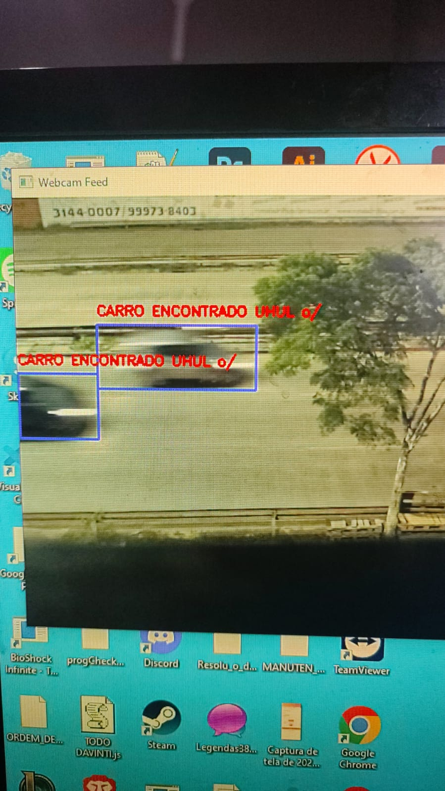

# carDetection.ai

O carDetection.ai é um aplicativo desenvolvido para detectar carros através de uma webcam em tempo real.

## Funcionamento

O aplicativo utiliza o modelo DETR (DEtection TRansformer) para processar frames da webcam e identificar a presença de carros.

### Detecção de Carro
Quando um carro é detectado, o aplicativo desenha uma caixa ao redor do carro e exibe a mensagem "CARRO ENCONTRADO UHUL o/" acima da caixa.

## Como Usar

1. Clone o repositório.
2. Instale as dependências necessárias com `pip install torch torchvision torchaudio opencv-python numpy'
3. Execute `python test.py` para iniciar a detecção de carros.
4. A interface mostrará duas janelas: uma com o feed da webcam em tempo real e outra com a última detecção de carro.

## Dependências

- Python 3.7 ou superior
- OpenCV
- PyTorch
- Transformers

## Sobre o projeto

O projeto foi feito em resposta a um convite de desafio na empresa. Como sou muito curioso, resolvi aceitar o desafio e aprender mais sobre o assunto.

## Licença

MIT
